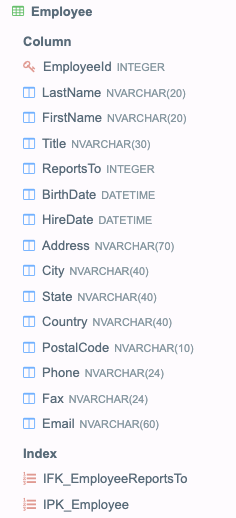

### Анализ продаж

В базе данных есть таблицы Invoice, Customer, Employee следующего вида:

  

 

 

Напишите запрос, который будет искать трех продавцов на маркетплейсе, совершивших больше всего продаж, начиная с 2010 года. На выходе в первой колонке должны быть имя и фамилия продавца, а во второй количество их продаж, отсортированное в порядке убывания.

** Примечание**
Для решения задачи используется база данных Chinook Database в формате Sqlite - см. файл [Chinook_Sqlite.sqlite](Chinook_Sqlite.sqlite).
 