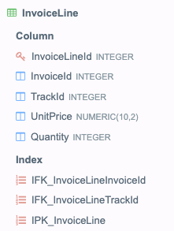
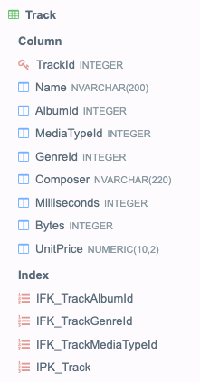

### Треки

В базе данных есть таблицы Invoice, InvoiceLine, Track следующего вида:

Напишите запрос, который составит рейтинг треков по их продаваемости, начиная с 2010 года. На выходе должны получиться
две колонки. В первой колонке должны быть Id трека, отсортированные в порядке возрастания, а во второй колонке -
количество проданных копий трека, отсортированных в порядке убывания.

** Примечание**
Для решения задачи используется база данных Chinook Database в формате Sqlite - см.
файл [Chinook_Sqlite.sqlite](Chinook_Sqlite.sqlite).

 