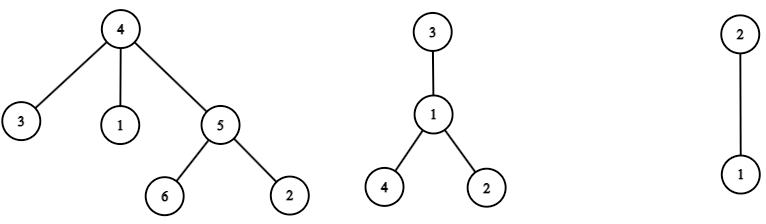

# C. Корень дерева (15 баллов)
|                                |                   |
|--------------------------------|-------------------|
| ограничение по времени на тест | 2 секунды         |
| ограничение по памяти на тест  | 512 мегабайт      |
| ввод                           | стандартный ввод  |
| вывод                          | стандартный вывод |
 

Корневое дерево — абстрактная структура данных, состоящая из вершин, соединённых рёбрами. В этой структуре данных есть ровно одна вершина, называемая корнем. Каждая вершина соединена рёбрами со своими сыновьями. Каждая вершина, кроме корня, имеет ровно одного родителя. Количество рёбер дерева на 1 меньше количества его вершин.

В этой задаче вершины дерева пронумерованы числами от 1 до 𝑛 в произвольном порядке.

Ниже приведены изображения трёх различных корневых деревьев.



У первого дерева корнем является вершина с номером 4, у второго дерева корнем является вершина с номером 3, у третьего дерева корнем является вершина с номером 2.

Закодируем дерево в виде последовательности (массива) целых чисел. Для этого выпишем в последовательность в произвольном порядке подряд коды всех вершин. Кодом вершины 𝑢 называется последовательность из 𝑑𝑢+2 чисел (где 𝑑𝑢 — количество сыновей вершины 𝑢):

* первое число кода вершины — её номер 𝑢,
* второе число кода вершины — количество её детей 𝑑𝑢, называемое также степенью этой вершины,
* затем следуют 𝑑 чисел — номера сыновей в произвольном порядке. 

Обратите внимание, что как вершина, так и само дерево в общем случае может быть закодировано неоднозначно.

Например, возможный код вершины 5 для первого дерева из примера может иметь вид: [5,2,2,6].

Возможные коды деревьев из примера:
* код первого дерева: [3,0,1,0,5,2,2,6,4,3,5,1,3,2,0,6,0] — в этом коде записаны вершины в следующем порядке [3,1,5,4,2,6];
* код второго дерева: [3,1,1,1,2,4,2,4,0,2,0] — в этом коде записаны вершины в следующем порядке [3,1,4,2];
* код третьего дерева: [1,0,2,1,1] — в этом коде записаны вершины в следующем порядке [1,2].

Напишите программу, которая по коду дерева выводит номер его корня.

**Входные данные**

В первой строке входных данных записано целое число 𝑡 (1≤𝑡≤100) — количество наборов входных данных.

Наборы входных данных в тесте независимы. Друг на друга они никак не влияют.

Каждый набор входных данных состоит из двух строк.

В первой из них записано целое число 𝑚 (2≤𝑚≤100) — длина последовательности, которая является кодом заданного дерева. Во второй содержится последовательность целых чисел 𝑎<sub>1</sub>,𝑎<sub>2</sub>,…,𝑎<sub>𝑚</sub> (0≤𝑎<sub>𝑖</sub><99) — код заданного дерева. Гарантируется, что 𝑎 является корректным кодом некоторого корневого дерева.

**Выходные данные**

Выведите 𝑡 строк — ответы на заданные наборы входных данных: 𝑗-я строка должна содержать номер вершины, которая является корнем в 𝑗-м наборе входных данных.

**Пример**

**Входные данные**
```
7
17
3 0 1 0 5 2 2 6 4 3 5 1 3 2 0 6 0
11
3 1 1 1 2 4 2 4 0 2 0
5
1 0 2 1 1
2
1 0
11
2 1 3 1 0 4 1 2 3 1 1
14
4 1 5 5 2 2 1 2 1 3 1 0 3 0
5
1 1 2 2 0
```

**Выходные данные**
```
4
3
2
1
4
4
1
```
