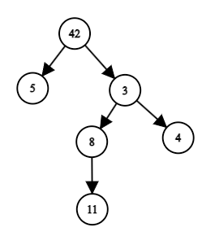

# I. Дерево иерархии в компании (25 баллов)

|                                |                   |
|--------------------------------|-------------------|
| ограничение по времени на тест | 5 секунд          |
| ограничение по памяти на тест  | 512 мегабайт      |
| ввод                           | стандартный ввод  |
| вывод                          | стандартный вывод |

В межгалактической компании Booble работают 𝑛 сотрудников. Каждый сотрудник характеризуется своим персональным
идентификатором — числом от 1 до 10<sup>6</sup>.

В этой компании царит строгая иерархия. Каждый сотрудник (кроме директора) находится в непосредственном подчинении у
ровно одного другого сотрудника. Каждый сотрудник может иметь произвольное количество подчинённых. Иными словами,
иерархия в компании образует дерево, корнем которого является директор.


Пример возможной иерархии в компании для случая 6 сотрудников. Директором является сотрудник с номером 42.

Для каждого сотрудника задан список, который содержит самого сотрудника и всех его подчинённых в произвольном порядке (
то есть порядок элементов списка можно считать случайным). Сами 𝑛 списков тоже даны в произвольном порядке.

По этой информации восстановите структуру дерева — выведите все рёбра соответствующего дерева, то есть 𝑛−1
пару чисел 𝑎<sub>𝑖</sub>,𝑏<sub>𝑖</sub>, где для 𝑎<sub>𝑖</sub> — непосредственный начальник, а 𝑏<sub>𝑖</sub> —
непосредственный подчинённый сотрудника 𝑎<sub>𝑖</sub>.

Для изображенного на рисунке примера вам могут быть даны следующие списки:

* [11,8];
* [3,11,4,8];
* [5];
* [11];
* [3,4,8,5,42,11];
* [4].

В таком случае вывод будет иметь вид (порядок пар не важен): (42,5), (42,3), (3,8), (3,4), (8,11).

Возможно, что заданные списки не будут соответствовать какому-то дереву иерархии 𝑛 сотрудников. В этом случае
определите, что решения не существует.

Неполные решения этой задачи (например, недостаточно эффективные) могут быть оценены частичным баллом.

**Входные данные**

В первой строке входных данных записано целое число 𝑡 (1≤𝑡≤1000) — количество наборов входных данных.

Наборы входных данных в тесте независимы. Друг на друга они никак не влияют.

В первой строке каждого набора записано целое число 𝑛 (2≤𝑛≤100), где 𝑛 — количество сотрудников в компании.

Далее заданы 𝑛 строк, каждая содержит список сотрудников — некоторого сотрудника и всех его подчинённых (
непосредственных и по цепочке) в произвольном порядке. Длина каждого списка — от 1 до 𝑛. Каждый список содержит
различные целые числа от 1 до 10<sup>6</sup>.

Не гарантируется, что каждый набор входных данных в самом деле соответствует некоторому дереву иерархии.

Гарантируется, что сумма значений 𝑛 по всем наборам входных данных теста не превосходит 10000.

**Выходные данные**

Для каждого набора входных данных выведите ответ.

Выведите YES, если решение существует. Затем в 𝑛−1 строке выведите искомые пары чисел 𝑎<sub>𝑖</sub>,𝑏<sub>𝑖</sub>.
Строки можно выводить в произвольном порядке.

Если решения не существует, то выведите NO.

**Пример**

**Входные данные**

```
8
6
11 8
3 11 4 8
5
11
3 4 8 5 42 11
4
2
1 2
2 1
7
6
4 2 1
1
7 5
4
7
1 2 3 4 5 6 7
2
2
1
2
1
1 2
4
4
2 4
1 2 3
3
3
2 3
3
1 3
4
2 3
1 4
2 3
1
```

**Выходные данные**

```
YES
3 4
3 8
8 11
42 3
42 5
NO
YES
2 1
2 4
3 2
3 5
3 6
5 7
NO
YES
2 1
NO
NO
NO
```
